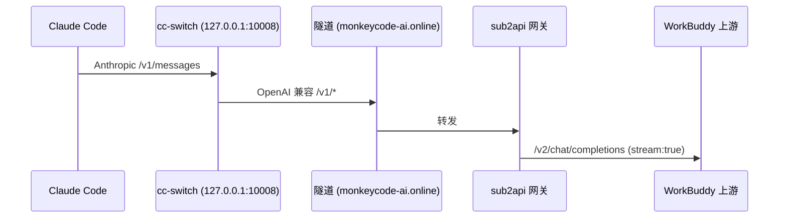

# Sub2API 项目说明文档

> 分支：`workbuddy`（基于上游 `Wei-Shaw/sub2api`，远程 `mine` = `QZLY11/subapi`）
> 更新时间：2026-09-16
> 本文档覆盖项目整体架构、WorkBuddy 平台集成、部署运维，以及 cc-switch/Claude Code 断连问题的完整排查与修复记录。

---

## 1. 项目概述

Sub2API 是一个 AI API 网关平台，核心能力是**订阅配额分发管理**：把多个上游账号
（OAuth 订阅 / API Key / Coding Plan 等）汇聚成账号池，通过统一网关对外提供
OpenAI / Anthropic / Gemini 兼容 API，支持客户端（Claude Code、Codex、cc-switch 等）
透明接入，并负责调度、计费、限流、故障转移。

| 维度 | 值 |
|---|---|
| 语言 | Go 1.27（后端）+ Vue 3.4（前端） |
| 存储 | PostgreSQL 15+（业务数据）+ Redis 7+（缓存/配额窗口） |
| 部署 | Docker Compose（GHCR 预构建镜像，服务器不本地编译） |
| 管理端 | 内置 Web 管理后台（账号/分组/Key/配额/日志） |
| 分支 | `workbuddy`：在主干基础上原生集成 WorkBuddy CN（CodeBuddy）平台 |

**工作流**：客户端 → 网关 `/v1/*` → 鉴权（api key）→ 分组 → 账号调度（选号/冷却/
failover）→ 上游转发（协议转换 + body 改写 + 身份头注入）→ 流式回传 + usage 计费落库。

---

## 2. 目录结构

```
sub2api/
├── backend/                 # Go 后端
│   ├── internal/
│   │   ├── config/          # 配置（viper，环境变量 GATEWAY_*）
│   │   ├── domain/          # 领域常量（平台/账号类型）
│   │   ├── handler/         # HTTP 处理器（gateway/admin 两套路由）
│   │   ├── service/         # 核心业务（网关转发/调度/计费/OAuth/平台 client）
│   │   ├── pkg/             # 工具包（apicompat 协议转换/logger 等）
│   │   └── server/          # HTTP 服务器与路由装配
│   ├── cmd/                 # 入口
│   └── migrations/          # 数据库迁移
├── frontend/                # Vue 3 管理后台
├── deploy/                  # Docker Compose 部署样例
├── docs/                    # 文档（含本文件）
├── .github/workflows/       # CI + workbuddy-image.yml（GHCR 镜像构建）
└── openspec/                # 规格与方案设计
```

---

## 3. 平台支持

| 平台 | 常量 | 说明 |
|---|---|---|
| Anthropic | `anthropic` | 原生 /v1/messages |
| OpenAI | `openai` | /v1/responses、/v1/chat/completions |
| Grok | `grok` | XAI 订阅 |
| Gemini | `gemini` | Google 订阅 |
| Kimi / Zhipu / Deepseek / MiniMax | 国产 OpenAI 兼容 | API Key / Coding Plan |
| OpenCode Go | `opencodego` | zen/go 订阅 |
| **WorkBuddy CN** | `workbuddy` | CodeBuddy / `copilot.tencent.com`，本分支新增 |

WorkBuddy 是**多协议入口平台**：客户端侧暴露 `/v1/messages`、`/v1/chat/completions`、
`/v1/responses` 三个入口，上游侧只有 `/v2/chat/completions` 一个端点且**强制流式**。

---

## 4. WorkBuddy 平台集成

详细设计见 [`workbuddy-integration-plan-b.md`](./workbuddy-integration-plan-b.md)，
实现说明见 [`workbuddy-integration-implementation.md`](./workbuddy-integration-implementation.md)。
此处只列运维必须知道的要点。

### 4.1 账号模型

- 账号类型：`AccountTypeWorkBuddyOAuth`（设备授权流接入，非 API Key）
- `credentials`（JSONB）：`access_token` / `refresh_token` / `expires_at` / `uid` /
  `enterprise_id` / `domain` / `device_token`
- token 生命周期约 1 小时，后台提前 1h 预热刷新（按 account id 抖动 ≤3min）

### 4.2 上游身份头（缺一不可）

```
Authorization: Bearer <access_token>
X-User-Id: <uid>
X-Enterprise-Id / X-Tenant-Id: <enterprise_id>（可选）
X-Domain: www.codebuddy.cn
Origin / Referer: https://www.codebuddy.cn
User-Agent: WorkBuddy/5.5.4 WorkBuddy/5.5.4 CLI/2.137.1（账号级可覆盖）
```

上游按 UA 指纹 + 身份头校验 issuer，缺头或用错 UA 返回 `401 not from a valid issuer`。

### 4.3 请求改写（`workbuddy_payload.go`）

发送上游前强制做以下改写：

1. `stream: true`（上游拒绝非流式，`11101 Non-stream ... not supported`）
2. `tool_choice` 归一化（对象形式会 400 code=11101）
3. `developer` role → `system`（上游 role 白名单不含 developer）
4. `messages[].content` 数组（Anthropic 风格块）折叠为纯字符串
5. 品牌词清洗（绕过上游渠道风控 11128）
6. deepseek 系模型注入 `thinking.type=enabled` + effort 降级管线

---

## 5. 部署与运维

### 5.1 构建链路

```text
本地 git push mine workbuddy
  → GitHub Actions workflow「WorkBuddy Image」（workbuddy-image.yml）
  → GHCR 镜像 ghcr.io/qzly11/subapi:workbuddy（约 4 分钟）
  → 服务器 pull + 重启容器
```

**触发构建**（HEAD 已推送到 workbuddy 分支后）：

```powershell
$token = "<github token>"
Invoke-WebRequest -Uri "https://api.github.com/repos/QZLY11/subapi/actions/workflows/workbuddy-image.yml/dispatches" `
  -Method POST -Headers @{ "Authorization" = "Bearer $token"; "Accept" = "application/vnd.github+json" } `
  -Body '{"ref":"workbuddy"}' -ContentType "application/json"
```

### 5.2 服务器部署（Debian 12，目录 `/sub2api-deploy`）

```bash
cd /sub2api-deploy
docker compose pull sub2api
docker compose up -d sub2api
docker compose ps   # 等待 (healthy)
```

> 注意：**不要在流式请求进行中执行 `docker compose up -d`**——会中断在途流。

### 5.3 数据库查询（PostgreSQL 容器内）

```bash
docker compose exec -T postgres psql -U sub2api -d sub2api -t -A -F'|' -c "<sql>"
```

关键表：

| 表 | 用途 |
|---|---|
| `api_keys` | Key 与分组/配额/限流窗口 |
| `accounts` | 上游账号（`status`、`schedulable`、`rate_limit_reset_at`、`temp_unschedulable_until`） |
| `groups` | 分组（`platform`、`allow_messages_dispatch`） |
| `usage_logs` | 每次请求的用量（`request_id`、`account_id`、`session_id`、`user_agent`、`first_token_ms`） |
| `ops_error_logs` | 错误事件（`error_phase`、`error_type`、`error_message`） |

### 5.4 关键配置

| 配置 | 环境变量 | 默认 | 说明 |
|---|---|---|---|
| `gateway.stream_keepalive_interval` | `GATEWAY_STREAM_KEEPALIVE_INTERVAL` | 10s | 网关 SSE 保活帧间隔（秒） |
| `gateway.image_stream_keepalive_interval` | `GATEWAY_IMAGE_STREAM_KEEPALIVE_INTERVAL` | 10s | 图像流保活 |
| `gateway.image_nonstream_keepalive_interval` | `GATEWAY_IMAGE_NONSTREAM_KEEPALIVE_INTERVAL` | 10s | 图像非流式保活 |

服务器容器已设置 `GATEWAY_STREAM_KEEPALIVE_INTERVAL=10` 与
`GATEWAY_IMAGE_STREAM_KEEPALIVE_INTERVAL=10`。

---

## 6. cc-switch / Claude Code 断连问题（完整修复记录）

### 6.1 问题现象

用户反馈（cc-switch 客户端，OpenAI 兼容 base 指向网关隧道，
Claude Code `user_agent = claude-cli/2.1.271`）：「会话总断开」「回复到一半断」
「回复一句话后断开」「大概两次 thinking 后中断」。断连后服务端收不到新请求，
`ops_error_logs` 无错误记录。

### 6.2 链路结构



三层链路，断点可能在任一层。cc-switch 本地有**熔断器**
（`circuit_failure_threshold=8`）：连续 8 次失败 → `CB-004 → Open` → 拉黑整个
provider，表现为会话中断且不再重试。

### 6.3 根因与修复（按时间倒序）

| 提交 | 根因 | 修复 |
|---|---|---|
| `e285e282d` | **403**：cc-switch 的 `/v1/messages` 辅助流量被 `allow_messages_dispatch` 闸门拦截（豁免列表漏了 workbuddy）；**502**：客户端非流式请求撞上强制流式上游，SSE 被当 JSON 解析 | ① workbuddy 加入 `IsMultiProtocolAPIKeyProvider` 豁免；② `readCCUpstreamJSONResponse` 检测 WorkBuddy SSE 响应并聚合为单个 JSON |
| `8a684044a` | keepalive grace 到期后仍空等一个完整周期才发首帧保活 | ticker 周期取 grace 与配置间隔的较小者 |
| `1e4572170` | 上游 `: heartbeat` 注释行不断刷新 `lastDataAt`，网关保活被无限跳过 | 保活判定改用 `lastClientWriteAt`（真正写给客户端的时刻） |
| `714dee4fd` | 静默拒绝检测器对 ≥64KB 请求体无限期抑制 keepalive，客户端零字节等待 109s/146s 后自行断开 | 抑制加 5s grace 上限 |
| `be8a09e8a` | 上游渠道风控 11128 返回后未隔离账号 | 正则锚定 + chat 路径隔离 + 账号 30min 冷却 |
| `82d4819fc` / `bd76c28df` | 上游拒绝空 name 的 `function_call` 对象 | 空 name+arguments 时整体删除该对象 |
| `62dbe564f` | 额度耗尽（429+14018）被误判软限流导致反复断流 | 正确分类为硬性额度错误 |
| `21a6587ad` | raw CC 直转无下游 SSE 保活 | 补上与主路径一致的 `:\n\n` 注释行保活 |
| `e0b617f30` / `b1637cf3c` | 上游 11128 渠道风控 + 11101 内容类型错误 | 品牌词清洗 + Anthropic 数组内容折叠 |

### 6.4 诊断方法（排障手册）

**第 1 步：确认服务端是否收到请求、是否完成**

```bash
# 网关日志按请求 id 追踪
docker compose logs sub2api --since 30m | grep <request_id>
# 关键行：gateway_check_start → gateway_check_done(allow) → http request completed(200)
```

**第 2 步：区分「服务端拒绝」与「客户端拉黑」**

- cc-switch 日志：`C:\Users\<user>\.cc-switch\logs\cc-switch.log`
  - `FWD-003 Provider ... 请求失败: 上游 HTTP 403/502 ...` → 服务端拒绝
  - `CB-004 熔断器触发 连续失败 N 次 → Open` → 客户端已拉黑该 provider
- cc-switch 请求明细表：`proxy_request_logs`（SQLite，`cc-switch.db`）

**第 3 步：按错误类型定位**

| 客户端日志 | 服务端日志 | 根因 |
|---|---|---|
| `403 This group does not allow /v1/messages dispatch` | 同左 | /v1/messages 闸门（已修复豁免） |
| `502 Failed to parse upstream response` | `parse chat completions response: invalid character ':'` | 非流式请求撞强制流式上游（已修复聚合） |
| 无报错直接断 | `http request completed 200` 但无 keepalive 帧 | keepalive 抑制（已修复） |

### 6.5 验证结果（2026-09-16 实测）

部署 `f5da6c17a` 后直连网关实测：

```text
T2_RESPONSES 200（非流式 /v1/responses，之前 502）
MSG_FLASH 200（/v1/messages deepseek-v4.1-flash，之前 403）
长流测试：5687 行 SSE、12.6s、正常 [DONE] 收尾
```

---

## 7. 本地开发

```powershell
# 后端（Windows）
cd backend
$env:PATH = "D:\Go\bin;$env:PATH"
go build ./...                          # 全量编译
go test -tags unit ./internal/service/  # 单测（-run 过滤用例）

# 提交（PowerShell 多行信息需写文件）
git add <files>
git commit -F .git\COMMIT_MSG_TMP.txt
git push mine workbuddy    # 走全局 socks 代理（127.0.0.1:10808，需 Clash 在线）
```

> 直连 GitHub 会被 reset（网络策略），必须用 git 全局代理（`socks5://127.0.0.1:10808`），
> 不要用 `-c http.proxy=` 清空代理。

---

## 8. 常见问题

| 问题 | 处置 |
|---|---|
| 上游 `401 not from a valid issuer` | 身份头/UA 错误，或 token 失效需重新 OAuth |
| 上游 `14018 额度已用尽` | token 有效但积分耗尽，去 `codebuddy.cn/profile/usage` 充值 |
| 上游 `11101` | body 含上游不接受的形态（非流式/content 数组/tool_choice 对象） |
| 上游 `11128` | 渠道风控（品牌词/未批准渠道），账号进入 30min 冷却 |
| 客户端「回复一半断」 | 按 §6.4 排障手册逐层定位 |
| CI workflow 红 | 预存在的 golangci-lint/test 失败，与 workbuddy 分支无关，可忽略 |

---

## 9. 相关文档

- [WorkBuddy 集成实现说明](./workbuddy-integration-implementation.md)
- [WorkBuddy 方案设计（Plan B）](./workbuddy-integration-plan-b.md)
- [主 README（中文）](../README_CN.md)
- [开发指南](../DEV_GUIDE.md)
